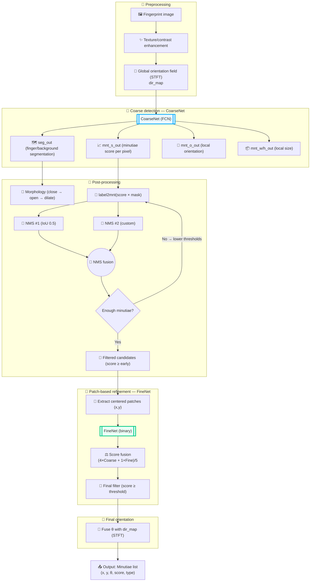

```mermaid
%% FingerFlow — minutiae extraction (coarse-to-fine)
flowchart TD
    %% ===== 1) PREPROCESSING =====
    subgraph PREP["🔧 Preprocessing"]
    direction TB
        A["🖼️ Fingerprint image"] --> B["✨ Texture/contrast enhancement"]
        B --> C["🧭 Global orientation field (STFT)\ndir_map"]
    end

    %% ===== 2) COARSE DETECTION (CoarseNet) =====
    subgraph COARSE["🧠 Coarse detection — CoarseNet"]
    direction TB
        C --> D[["CoarseNet (FCN)"]]
        D --> D1["🗺️ seg_out (finger/background segmentation)"]
        D --> D2["📈 mnt_s_out (minutiae score per pixel)"]
        D --> D3["🧭 mnt_o_out (local orientation)"]
        D --> D4["📦 mnt_w/h_out (local size)"]
    end

    %% ===== 3) POST-PROCESSING + NMS + ADAPTIVE THRESHOLDS =====
    subgraph POST["🧹 Post-processing"]
    direction TB
        D1 --> E1["🧼 Morphology (close → open → dilate)"]
        D2 --> E2["🔧 label2mnt(score × mask)"]
        E2 --> E3["🧹 NMS #1 (IoU 0.5)"]
        E2 --> E4["🧹 NMS #2 (custom)"]
        E3 --> E5(("🔗 NMS fusion"))
        E4 --> E5
        E5 --> F{"Enough minutiae?"}
        F -- "No → lower thresholds" --> E2
        F -- "Yes" --> G["🔎 Filtered candidates (score ≥ early)"]
    end

    %% ===== 4) FINE VERIFICATION (FineNet) =====
    subgraph FINE["🧠 Patch-based refinement — FineNet"]
    direction TB
        G --> H["🧩 Extract centered patches (x,y)"]
        H --> I[["FineNet (binary)"]]
        I --> J["⚖️ Score fusion\n(4×Coarse + 1×Fine)/5"]
        J --> K["🧪 Final filter (score ≥ threshold)"]
    end

    %% ===== 5) FINAL ORIENTATION =====
    subgraph ORI["🧭 Final orientation"]
    direction TB
        K --> L["🔗 Fuse θ with dir_map (STFT)"]
    end

    L --> M["📤 Output: Minutiae list\n(x, y, θ, score, type)"]

    %% Styles
    style D stroke:#00aaff,stroke-width:3px,fill:#eaf7ff,rx:8,ry:8
    style I stroke:#00cc88,stroke-width:3px,fill:#eafff6,rx:8,ry:8
```
